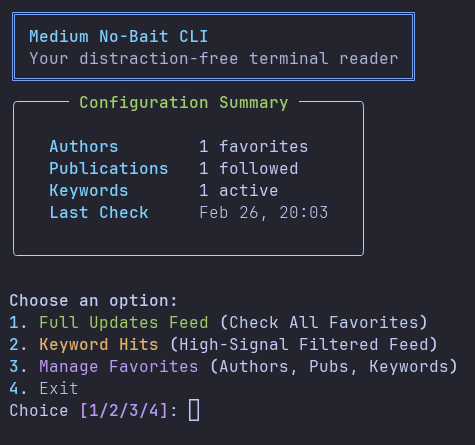

# Medium No-Bait CLI



A high-performance, terminal-based Medium reader designed for developers who value signal over noise. Track your favorite authors and publications, and catch the most relevant stories without the "clap-bait" and social distractions.

## Why it exists?
On Medium, the home feed is an algorithm designed to keep you scrolling. **Medium No-Bait CLI** gives you a strictly curated, high-signal experience that only shows you what YOU chose to follow.

- **Zero Distractions**: No ads, no claps, no social pressure.
- **Keyword Hits**: Catch the most relevant stories using custom filters that scan **Titles** and **Tags**.
- **RSS-Powered**: Lightning-fast update checks.
- **Premium Detection**: Clear `[Member Only]` labels for paywalled content.
- **Terminal First**: Clean, full links that are 100% clickable for your browser.

## Quick Start

### Installation

**Option 1: Install from PyPI (Recommended)**
```bash
pip install medium-no-bait-cli
```

**Option 2: Local development installation**
1. Clone the repository:
   ```bash
   git clone https://github.com/hubshashwat/medium-no-bait-cli.git
   cd medium-no-bait-cli
   ```

2. Install the package locally:
   ```bash
   pip install -e .
   ```

### Running the App
Once installed, you can simply type:
```bash
mnb
```

## How It Works

1. **Manage Favorites**: Add authors (use `@username`) and publications (use the pub name from the URL, e.g., `the-startup`).
2. **Setup Keywords**: Add specific keywords you want to track across your favorites.
3. **Enjoy Signal**: Use the **Keyword Hits** view to see exactly what you care about.

## Project Structure
- `src/medium_no_bait/main.py`: The central terminal interface.
- `src/medium_no_bait/author_updates/`: Logic for tracking and filtering updates.
- `src/medium_no_bait/shared/`: Shared tools (RSS Scraper, Storage).

---
Built with 💙 for the Medium developer community.
